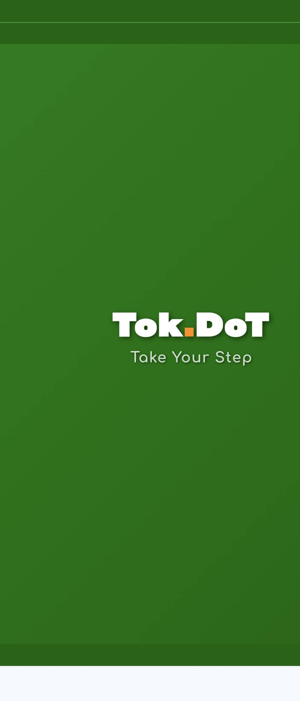
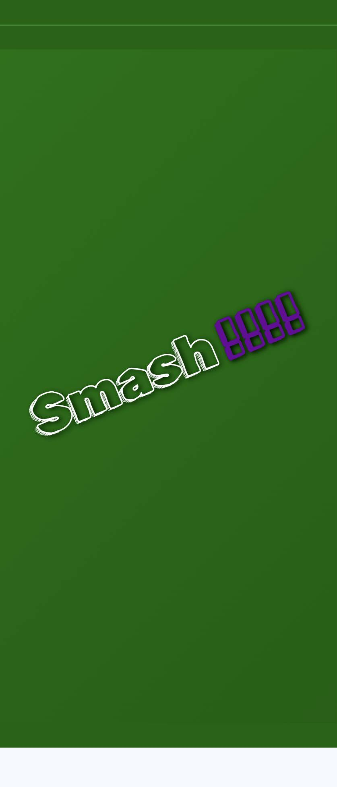
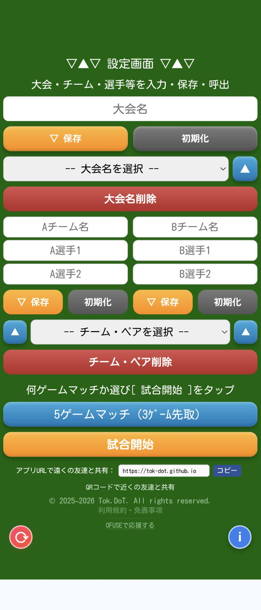
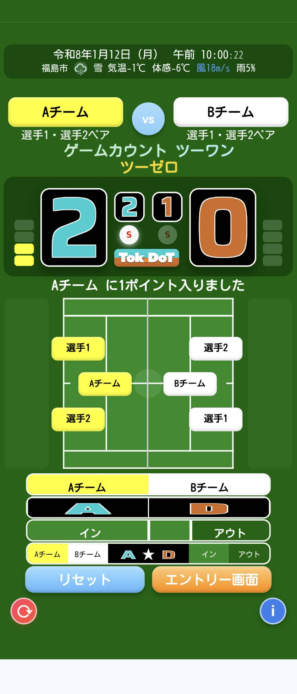

# Smash!!!! 🎾

ソフトテニス ダブルスマッチ用  
**観戦者向けスコアボード Webアプリ**

Smash!!!! は、  
スコアボードがないソフトテニスのダブルスマッチで、  
観戦者が「今、何点？」と迷わず応援できる  
観戦者向けスコアボード Webアプリです。

---

## 📌 このアプリについて

ソフトテニスの試合では、

- ルールや得点の流れが分かりにくい  
- スコアボードが設置されていない試合も多い  

といった理由から、  
観戦中に「今、何点だっけ？」と  
分からなくなってしまう場面が少なくありません。

このアプリは、  
**観戦者自身が得点を記録しながら試合を追う**ことで、  
試合の流れを自然に理解し、  
**熱い戦いに、そっと寄り添いながら応援できる**ことを  
目的として作られています。

---

## ⚠️ ご利用にあたっての注意

- 本アプリは **公式記録用ではありません**
- 観戦・応援を楽しむための **補助ツール** です
- 記録の正確性を保証するものではありません

大会や公式記録については、  
必ず主催者・審判の指示に従ってください。

---

## 🎮 主な機能

- ダブルス専用スコア管理
- 観戦位置に合わせたコート回転
- サーバー表示・管理
- ポイントの追加・巻き戻し
- 試合画面のカスタマイズ
- お気に入り設定の保存（最大5件）

※ 操作は **タップ中心** で、  
保護者や観戦者の方でも  
直感的に使える設計を目指しています。

---

## 🖥️ 使い方（概要）

1. 設定画面でゲームマッチ数などを設定  
2. 観戦位置に合わせてコートを回転  
3. 選手・サーバーを設定  
4. 試合開始後、ポイントをタップして記録  

詳しい操作方法は、  
アプリ内の **インフォメーション（i）** をご覧ください。

---

## 🌐 公開URL

👉 https://tok-dot.github.io/

※ スマートフォンでの利用を推奨しています

---

## ❤️ 応援・サポート

このアプリが  
「便利だな」「使ってよかった」と感じていただけましたら、  
開発の励みとして **任意でのご支援** を  
ご検討いただけると嬉しいです。

👉 **OFUSEで応援する**  
https://ofuse.me/tokdot

※ 支援は必須ではありません。  
無料でご利用いただけます。

---

## 👤 開発者

- 個人開発
- スポーツ観戦を、もっと楽しくするツールを制作中

---

## 📄 ライセンス・著作権

© 2025–2026 Tok.DoT / Hiroki Sato. All rights reserved.

本リポジトリ内の  
ソースコード・デザイン・文章の無断転載は禁止されています。

---

## スクリーンショットギャラリー

  
  
  
  
  
  

*スクロールして各スクリーンショットを確認できます。*

